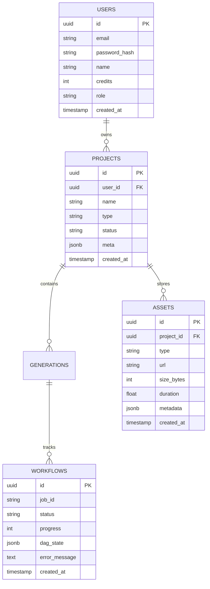

# AI Video Studio (Self-Hosted)

A fully self-hosted, modular AI-powered video and content creation platform for generating:
- **AI Videos** (Veo, Kling, Runway, LTX Video, Wan Video, Hunyuan Video, SVD)
- **AI Images** (FLUX Schnell, SDXL Turbo, Juggernaut XL via ComfyUI)
- **UGC Ads** (Authentic creator avatars, script-to-avatar, talking heads, Wav2Lip)
- **YouTube Shorts & Viral Reels** (Hook-to-CTA automation, timed caption burns)
- **TikTok / Reels Content** (Vertical 9:16, dynamic pattern interrupts)
- **Neural Voiceovers** (Piper, Coqui TTS, ElevenLabs, OpenAI TTS)
- **Pre-visualization Storyboards** (Shot keyframes before expensive video generation)
- **Automated Marketing Creatives** (Multi-scene campaign generation)

This platform is engineered as a private, cost-effective, self-hosted alternative to commercial SaaS platforms (Runway, HeyGen, Viewmax, InVideo).

---

## Table of Contents

- [Objectives](#objectives)
- [System Overview](#system-overview)
- [Core Modules & Tech Stack](#core-modules--tech-stack)
- [Repository Structure](#repository-structure)
- [Architecture](#architecture)
- [The 20-Stage AI Pipeline](#the-20-stage-ai-pipeline)
- [The Scene Planner](#the-scene-planner)
- [The Shot Planner (The AI Director)](#the-shot-planner-the-ai-director)
- [DAG Workflow System](#dag-workflow-system)
- [Storyboard Pipeline](#storyboard-pipeline)
- [Character Consistency System](#character-consistency-system)
- [Voice Generation System](#voice-generation-system)
- [Image Generation System](#image-generation-system)
- [Video Generation System](#video-generation-system)
- [FFmpeg Render Pipeline](#ffmpeg-render-pipeline)
- [Storage Architecture](#storage-architecture)
- [Database Schema](#database-schema)
- [Local Development Setup](#local-development-setup)
- [Deployment Guide](#deployment-guide)
- [Scaling Guide & Performance Optimization](#scaling-guide--performance-optimization)
- [Implementation Order](#implementation-order)
- [Development Roadmap](#development-roadmap)
- [Guiding Principles](#guiding-principles)

---

# Objectives

## Primary Goals
- **Generate professional videos from prompts**: Turn simple ideas into social-ready videos.
- **Create structured multi-scene content**: Decompose stories into timed beats rather than generating monolithic unstable clips.
- **Maintain character consistency**: Enforce facial and clothing identity continuity across cuts.
- **Support multiple AI backends**: Intersect local open-source inference (ComfyUI, Ollama, Piper) with cloud APIs (Runway, ElevenLabs).
- **Self-host everything possible**: Run locally on consumer or workstation GPUs (RTX 3090/4090).
- **Minimize ongoing costs**: Use pre-vis storyboards to validate scenes before rendering expensive video clips.
- **Modular architecture**: Microservices-ready monolith with independent workers.
- **Scalable workflow orchestration**: Execute generation tasks as Directed Acyclic Graphs (DAGs).

---

# System Overview

```text
                     ┌────────────────────────┐
                     │          User          │
                     └───────────┬────────────┘
                                 │
                                 ▼
                     ┌────────────────────────┐
                     │   Frontend (Next.js)   │
                     └───────────┬────────────┘
                                 │
                                 ▼
                     ┌────────────────────────┐
                     │    FastAPI Backend     │
                     └───────────┬────────────┘
                                 │
                                 ▼
                     ┌────────────────────────┐
                     │    Workflow Engine     │
                     └───────────┬────────────┘
                                 │
                                 ▼
                     ┌────────────────────────┐
                     │     Scene Planner      │
                     └───────────┬────────────┘
                                 │
                                 ▼
                     ┌────────────────────────┐
                     │      Shot Planner      │
                     └───────────┬────────────┘
                                 │
         ┌───────────────────────┼───────────────────────┐
         ▼                       ▼                       ▼
┌──────────────────┐   ┌──────────────────┐   ┌──────────────────┐
│   Image Worker   │   │   Video Worker   │   │   Voice Worker   │
└────────┬─────────┘   └────────┬─────────┘   └────────┬─────────┘
         │                       │                       │
         └───────────────────────┼───────────────────────┘
                                 │
                                 ▼
                     ┌────────────────────────┐
                     │     Render Workers     │
                     │    (FFmpeg Engine)     │
                     └───────────┬────────────┘
                                 │
                                 ▼
                     ┌────────────────────────┐
                     │    Storage / MinIO     │
                     └───────────┬────────────┘
                                 │
                                 ▼
                     ┌────────────────────────┐
                     │      Final Video       │
                     └────────────────────────┘
```

---

# Core Modules & Tech Stack

### Frontend
- **Responsibilities**: User authentication, project dashboard, asset library, prompt engineering launchpad, storyboard visualizer, video player, and real-time DAG monitor.
- **Stack**: Next.js 15 (App Router), TypeScript, TailwindCSS v4, ShadCN UI, TanStack Query, Zustand, Lucide React, Framer Motion.

### Backend
- **Responsibilities**: REST API gateway, JWT auth & token rotation, workflow state machines, job queues, asset metadata, billing & credits ledger.
- **Stack**: FastAPI, SQLAlchemy 2.0 (Async), Alembic, Pydantic v2, PostgreSQL 16, Redis 7 (ARQ Queue & Pub/Sub).

### Worker Layer
- **Responsibilities**: Asynchronous compute nodes consuming jobs from Redis/SQS.
- **Stack**: Python 3.12, ComfyUI API, Ollama, Piper TTS, FFmpeg 7, OpenCV, PyTorch.

---

# Repository Structure

```text
project-root/
├── apps/
│   ├── web/                     # Next.js 15 frontend application
│   ├── api/                     # FastAPI backend & API gateway
│   └── admin/                   # Internal worker administration dashboard
│
├── workers/
│   ├── image-worker/            # ComfyUI / FLUX / SDXL inference worker
│   ├── video-worker/            # SVD / LTX / Wan / Hunyuan / Kling worker
│   ├── voice-worker/            # Piper / Coqui / ElevenLabs TTS worker
│   ├── render-worker/           # FFmpeg hardware-accelerated compositor
│   └── storyboard-worker/       # Keyframe pre-visualization generator
│
├── services/
│   ├── auth-service/            # Authentication & RBAC
│   ├── generation-service/      # AI model provider adapters
│   ├── project-service/         # Project lifecycle & asset metadata
│   └── workflow-service/        # DAG state machine & execution tracking
│
├── infrastructure/
│   ├── docker/                  # Docker Compose & service definitions
│   ├── kubernetes/              # K8s deployment manifests & Helm charts
│   └── terraform/               # Cloud resource provisioning
│
├── docs/                        # Architecture & API documentation
│
└── shared/                      # Common schemas, types, and utilities
```

---

# Architecture

```text
Frontend (Next.js 15)
       │
       ▼
FastAPI Gateway
       │
Workflow Layer (DAG State Machine)
       │
┌──────┴───────────────┬──────────────────────┐
▼                      ▼                      ▼
Scene Planner          Asset Manager          Queue Service (Redis)
       │
       ▼
Shot Planner (AI Director)
       │
       ▼
Storyboards (Pre-vis Frames)
       │
       ▼
Generation Workers (Parallel Video & Audio)
       │
       ▼
Rendering Workers (FFmpeg Concat, Audio Mix & Burn)
       │
       ▼
Final Video Export & CDN Delivery
```

---

# The 20-Stage AI Pipeline

The pipeline orchestrator transforms a prompt into a finished video through a sequence of specialized stages:

1. **User Request Layer**: Validates aspect ratio (`9:16`, `16:9`, `1:1`), duration, visual style, voiceover talent, and platform target.
2. **Project & Queue Registration**: Allocates `project_id` and `job_id`, records initial DB state, enqueues in Redis/SQS.
3. **AI Orchestrator**: Central DAG engine initializing execution branches and status observers.
4. **Prompt Enhancement**: Expands simple concepts into rich cinematic directions (camera motion, volumetric lighting).
5. **Safety & Moderation**: Scans prompt against NSFW, violence, copyright, and brand restrictions.
6. **Script Generation**: Synthesizes high-converting copy formatted into Hook, Problem, Solution, and CTA.
7. **Scene Planning**: Divides narrative copy into timed scene storyboards.
8. **Shot Planning**: AI Director decomposes scenes into sub-scene camera cuts with lenses and rig instructions.
9. **Storyboard Generation**: Generates pre-vis keyframe images for human approval.
10. **Image Generation**: Renders high-fidelity scene keyframes (FLUX / SDXL).
11. **Video Generation**: Dispatches parallel video workers (Veo, Kling, LTX Video, Hunyuan).
12. **Voice Generation**: Synthesizes neural voiceover audio (Piper, Coqui, ElevenLabs).
13. **Background Music Selection**: Selects mood/BPM-matched soundtrack with automated -18dB sidechain ducking.
14. **Caption & Subtitle Generator**: Calculates word-level timestamps (Hormozi, TikTok, MrBeast styles).
15. **UGC Avatar & Lip-Sync**: Synchronizes avatar facial movements with speech phonemes (Wav2Lip).
16. **Video Composition Graph**: Compiles multi-track audio and video filtergraphs.
17. **FFmpeg Hardware Render Farm**: Merges clips, applies whip-pan transitions, color grading LUTs, and subtitles.
18. **AI Quality Scoring**: Multimodal evaluation of lip-sync, visual consistency, and audio balance (0-100).
19. **Storage Layer**: Writes artifacts to structured storage paths (`projects/`, `videos/`, `audio/`, `exports/`).
20. **User Notification**: Dispatches real-time WebSocket events (`job.progress`, `job.completed`).

---

# The Scene Planner

### Purpose
Converts user intent and scripts into discrete, timed visual scenes.

Without a scene planner, video models receive monolithic prompts like *"Create a 30-second protein shake ad"*, resulting in hallucinations and visual drift. The Scene Planner decomposes stories into structured narrative segments.

### Example Input & Output

**Input:**
```text
Create a 30-second TikTok ad for a protein shake.
```

**Output:**
```json
{
  "title": "UltraShake 30s High-Converting UGC Social Ad",
  "scenes": [
    {
      "id": 1,
      "goal": "hook",
      "duration": 4.0,
      "visual": "Athletic creator dropping dumbbells, breathless direct eye contact"
    },
    {
      "id": 2,
      "goal": "problem",
      "duration": 5.0,
      "visual": "Frustrated creator inspecting chalky clumps in cloudy shaker bottle"
    },
    {
      "id": 3,
      "goal": "product_reveal",
      "duration": 6.0,
      "visual": "Hero sleek bottle reveal illuminated by volumetric morning sunlight"
    },
    {
      "id": 4,
      "goal": "benefits",
      "duration": 10.0,
      "visual": "Macro slow-motion liquid pour at 120fps with velvety chocolate vortex"
    },
    {
      "id": 5,
      "goal": "call_to_action",
      "duration": 5.0,
      "visual": "Creator holding product tub with animated 25% discount badge overlay"
    }
  ]
}
```

### Key Responsibilities
- **Story Decomposition**: Extracts core story beats.
- **Narrative Classification**: Maps beats to marketing roles (`HOOK`, `PROBLEM`, `REVEAL`, `VALUE`, `CONVERSION`).
- **Duration Allocation**: Weights screen time dynamically (Hook ~18%, Problem ~22%, Value ~40%, CTA ~20%).
- **Character Planning**: Assigns character consistency tokens.
- **Environment Planning**: Binds shared location and lighting profiles.
- **Pacing Analysis**: Maps motion intensity (Hook: 85%, Value: 55%, CTA: 25%).

---

# The Shot Planner (The AI Director)

### Purpose
Acts as the AI Director. While the scene planner determines *what* happens narratively, the shot planner determines *how* it is captured cinematically.

A scene may consist of multiple shots to ensure visual momentum.

```json
{
  "scene": "product_reveal",
  "shots": [
    {
      "shot_number": 1,
      "type": "wide",
      "duration": 2.0,
      "lens": "35mm prime",
      "camera": "Motorized slider tracking lateral glide"
    },
    {
      "shot_number": 2,
      "type": "macro",
      "duration": 2.5,
      "lens": "100mm f/2.8 macro",
      "camera": "180-degree orbital sweep capturing 120fps liquid pour"
    },
    {
      "shot_number": 3,
      "type": "closeup",
      "duration": 1.5,
      "lens": "50mm portrait",
      "camera": "Handheld steady subtle slow push-in"
    }
  ]
}
```

### Responsibilities
1. **Shot Taxonomy Catalog**: Standardizes shots (`closeup` for emotion, `wide` for setting, `tracking` for motion, `macro` for tactile texture).
2. **Cinematic Rules Engine**: Enforces framing rules (Hook scenes prefer Handheld 28mm; Value scenes prefer Macro Slider; CTA scenes prefer Centered Tripod).
3. **Camera Planning**: Specifies focal lengths, physical rig motions (Dolly, Handheld, Slider, Crane, Orbit), and camera angles.
4. **Prompt Construction**: Translates marketing copy into pure generative optical syntax for video models.

---

# DAG Workflow System

### What is a DAG?
A **Directed Acyclic Graph (DAG)** represents tasks and their dependencies, enabling non-linear execution.

### Linear vs. DAG Workflow

**Traditional Linear Pipeline (Fragile & Slow):**
```text
Task A ──▶ Task B ──▶ Task C ──▶ Task D
```
*Disadvantages: Sequential latency, zero parallelism, single point of failure.*

**Viewmax DAG Pipeline (Parallel & Resilient):**
```text
                  Script
                    │
                    ▼
              Scene Planner
                    │
        ┌───────────┼───────────┐
        ▼           ▼           ▼
     Scene 1     Scene 2     Scene 3
        │           │           │
        ▼           ▼           ▼
     Shots       Shots       Shots
        │           │           │
        ▼           ▼           ▼
     Video 1     Video 2     Video 3
        └───────────┬───────────┘
                    │
                    ▼
            FFmpeg Rendering
```

### Key DAG Benefits
- **Parallel Processing**: Video workers render Scene 1, Scene 2, Scene 3, and voiceovers simultaneously.
- **Fault Isolation**: If Scene 2 fails due to a worker timeout, only Scene 2 is retried.
- **Character Consistency**: All parallel scene nodes inherit the same reference character embedding.
- **Smart Regeneration**: Editing Scene 4 only triggers re-rendering of Scene 4 and the final FFmpeg concatenation.
- **Resource Optimization**: Expensive video generation runs only after lightweight storyboards pass QA.

---

# Checkpointing in a DAG Workflow

Checkpointing is one of the most important concepts in a DAG workflow. Think of it as saving progress at every significant stage so the system can resume from the last successful step instead of starting over.

### What is a Checkpoint?

A checkpoint is a saved workflow state.

```text
Without Checkpointing:
Prompt ✅ ──▶ Script ✅ ──▶ Scene Planning ✅ ──▶ Storyboard ✅ ──▶ Video Generation ❌
                                                                       │
                                ┌──────────────────────────────────────┘
                                ▼
                         Restart from Prompt (All compute lost)

With Checkpointing:
Prompt ✅ ──▶ Script ✅ ──▶ Scene Planning ✅ ──▶ Storyboard ✅ ──▶ Video Generation ❌
                                                                       │
                                ┌──────────────────────────────────────┘
                                ▼
                         Resume from Video Generation (Only failed node rerun)
```

This saves time, compute, and debugging effort.

---

### Why Checkpointing Matters

Imagine a production workflow that takes:

| Stage | Execution Duration | Status Without Checkpoints |
|---|---|---|
| Prompt Enhancement | 5s | ✅ Saved |
| Script Generation | 10s | ✅ Saved |
| Scene Planning | 15s | ✅ Saved |
| Storyboard Generation | 60s | ✅ Saved |
| Video Generation | 300s | ✅ Saved |
| Rendering | 120s | ❌ Failed at 500s |
| **Total** | **510s** | |

- **Without checkpoints**: 510 seconds wasted. You restart from the initial prompt.
- **With checkpoints**: Rendering failed ──▶ Resume from Rendering. Only **120 seconds** must be redone.

---

### Checkpoints in an AI Video Workflow

```text
Prompt
  │
  ▼
Script
  │
  ▼
Scene Planning
  │
┌─Scene 1─┐
│         │
├─Scene 2─┤
│         │
└─Scene 3─┘
  │
Storyboards (Keyframes)
  │
Videos (Clips)
  │
Voice (Voiceover TTS)
  │
Render (FFmpeg Compositing)
  │
Export (CDN Distribution)
```

> **Rule**: Checkpoint after every major node.

---

### What Gets Saved?

Each checkpoint records comprehensive node metadata, outputs, and dependencies:

```json
{
  "workflow_id": "wf_123",
  "node": "storyboard_scene_2",
  "status": "completed",
  "output": "storage/storyboards/scene2.png",
  "completed_at": "2026-01-01T12:00:00Z",
  "metadata": {
    "scene_index": 1,
    "shot_index": 0,
    "duration_ms": 2400,
    "attempts": 1,
    "model": "flux-1-schnell"
  },
  "dependencies": ["scene_plan"],
  "timing": {
    "started_at": "2026-01-01T11:59:57Z",
    "duration_s": 2.4
  }
}
```

Checkpoints store:
- **Outputs**: S3 keys, local paths, JSON artifacts
- **Metadata**: Generation parameters, model versions, seed numbers
- **Execution Status**: `pending`, `running`, `completed`, `failed`, `awaiting_approval`
- **Dependencies**: Parent node IDs required before execution
- **Timing**: Latency, start/end timestamps, retry count

---

### Database Design

PostgreSQL schema for workflow node checkpoints:

```sql
CREATE TABLE workflow_nodes (
    id UUID PRIMARY KEY DEFAULT gen_random_uuid(),
    workflow_id UUID NOT NULL,
    node_name TEXT NOT NULL,
    granularity TEXT NOT NULL DEFAULT 'workflow',
    scene_index INTEGER,
    shot_index INTEGER,
    status TEXT NOT NULL,          -- pending | running | completed | failed | awaiting_approval
    output_path TEXT,
    output_meta JSONB,
    input_hash TEXT,
    attempts INTEGER DEFAULT 0,
    max_attempts INTEGER DEFAULT 3,
    error_message TEXT,
    started_at TIMESTAMP WITH TIME ZONE,
    completed_at TIMESTAMP WITH TIME ZONE
);

CREATE INDEX ix_workflow_nodes_wf ON workflow_nodes (workflow_id, node_name);
CREATE INDEX ix_workflow_nodes_hash ON workflow_nodes (workflow_id, input_hash);
```

#### Node Status Lifecycle
- `pending`: Registered in the DAG, waiting for parent dependencies
- `running`: Currently executing on a worker
- `completed`: Successfully finished with validated output
- `failed`: Errored out (recoverable if `attempts < max_attempts`)
- `awaiting_approval`: Paused at a human-in-the-loop review gate

---

### Checkpoint Granularities

#### 1. Scene-Level Checkpoints
Instead of checkpointing only the whole project, store progress per scene:
- `Scene 1`: ✅ Completed
- `Scene 2`: ✅ Completed
- `Scene 3`: ❌ Failed
- **Resume**: Scene 3 only.

#### 2. Shot-Level Checkpoints
Even more granular for multi-shot complex scenes:
- Scene: *Gym Scene*
  - `Wide Shot`: ✅ Completed
  - `Closeup`: ✅ Completed
  - `Tracking Shot`: ❌ Failed
- **Retry**: Tracking Shot only.

#### 3. Storyboard Checkpoints
Storyboard completion is saved before video models run. If video model requirements change (e.g. switching from Wan 2.1 to Veo 2):
- **Reuse**: Existing approved storyboard keyframes
- **Regenerate**: Video clips only
- *Eliminates redundant image generation cost & time.*

#### 4. Character Consistency Checkpoints
Generate character identity once:
```json
{
  "character_id": "hero_01",
  "reference_image": "storage/characters/hero_01.png",
  "embeddings_path": "storage/characters/hero_01_ipadapter.bin"
}
```
All future scenes inherit and reuse this checkpoint. If a downstream scene fails, character generation never reruns.

#### 5. Asset Reuse Through Checkpoints
Brand logos, color palettes, motion graphics templates, and synthetic voice profiles are checkpointed once:
```json
{
  "asset_id": "brand_logo",
  "asset_path": "storage/assets/brand_logo.png",
  "voice_profile": "elevenlabs_adam_v2"
}
```
Downstream nodes reference existing checkpointed assets without re-fetching or re-synthesizing.

---

### Retry Logic

The workflow engine checks completion state before scheduling execution:
```text
Has this node already completed with valid output?
  ├── YES ──▶ Skip execution (Cache Hit)
  └── NO  ──▶ Has attempts < max_attempts?
                ├── YES ──▶ Increment attempts and execute
                └── NO  ──▶ Mark job as failed, alert operator
```

Example recovery:
- `Script`: ✅ Completed (Skipped)
- `Scene Planner`: ✅ Completed (Skipped)
- `Storyboard`: ✅ Completed (Skipped)
- `Video`: ❌ Failed
- **Action**: Retry Video only.

---

### Checkpoint Recovery & Crash Resilience

Worker or machine crashes mid-flight:

**Before Crash State:**
```text
completed:
  - scene1
  - scene2
  - scene3
running:
  - video2
```

**After Restart:**
1. Reload workflow checkpoint state from PostgreSQL/Redis
2. Identify incomplete nodes (`video2` was in `running` status)
3. Continue from `video2` without re-running `scene1`, `scene2`, or `scene3`

---

### Human Review Workflows

Checkpoints enable Human-in-the-Loop approval gates:

```text
Prompt ──▶ Script ──▶ Scene Planner ──▶ Storyboard ──▶ Human Review ──▶ Video Generation ──▶ Render
                                                              │
                                                   status: waiting_for_approval
                                                   Workflow pauses
                                                              │
                                                   [Creator Clicks "Approve"]
                                                              │
                                                              ▼
                                                   Resume to Video Generation
```

Temporal and Viewmax orchestrator handle this with signals and checkpoint pause states.

---

### Distributed Worker Benefits

Distributed execution across GPU worker pools:
- `Worker A`: Renders Scene 1
- `Worker B`: Renders Scene 2
- `Worker C`: Crashes while rendering Scene 3

**Checkpoint Engine detects:**
- `Scene 1`: ✅ Completed
- `Scene 2`: ✅ Completed
- `Scene 3`: ❌ Incomplete / Worker Heartbeat Lost

**Action**: Another idle worker picks up `Scene 3` immediately without interrupting Workers A or B.

---

### Example Workflow State Object

```json
{
  "workflow_id": "wf_protein_ad_9921",
  "nodes": {
    "script": { "status": "completed", "output": "s3://viewmax/scripts/wf_protein_ad_9921.json" },
    "scene_plan": { "status": "completed", "output": "s3://viewmax/plans/wf_protein_ad_9921.json" },
    "storyboard_1": { "status": "completed", "output": "s3://viewmax/storyboards/scene_1.png" },
    "storyboard_2": { "status": "completed", "output": "s3://viewmax/storyboards/scene_2.png" },
    "video_1": { "status": "completed", "output": "s3://viewmax/clips/scene_1.mp4" },
    "video_2": { "status": "failed", "attempts": 2, "error": "CUDA out of memory on worker-gpu-04" }
  },
  "resume_target": "video_2"
}
```

Recovery restarts execution targeting `video_2` directly.

---

### Temporal vs Celery Checkpointing

| Dimension | Celery | Temporal |
|---|---|---|
| **Checkpoint Storage** | Manual DB persistence (`save_status(node, "completed")`) | Native Event History & State Machine |
| **Recovery** | Custom query & DAG state reconstruction logic | Automatic workflow replay from event history |
| **Crash Resilience** | Requires custom heartbeat monitoring & redis locks | Built-in cluster orchestration & automatic re-dispatch |
| **Human Review Pause** | Complex polling or task idling | Native workflow signals (`await workflow.wait_condition(...)`) |
| **Implementation Effort** | Higher custom code, lightweight runtime | Lower boilerplate, dedicated cluster infrastructure |

*Viewmax implements a database & Redis-backed Checkpoint Manager modeled after Temporal event semantics for high performance and zero external dependencies.*

---

### Best Practices for Your AI Video Pipeline

Checkpoint at these 12 critical milestones:
1. **Prompt Enhancement**
2. **Script Generation**
3. **Scene Planning**
4. **Character Generation & Embedding**
5. **Storyboard Generation** (per-scene keyframes)
6. **Video Generation** (per-scene / per-shot video clips)
7. **Voice Generation** (TTS audio tracks)
8. **Caption Generation** (word-level SRT/VTT)
9. **Music & Audio Ducking**
10. **Render Start** (composition graph compiled)
11. **Render Complete** (final FFmpeg MP4)
12. **Final Export** (CDN edge distribution)

#### Key Outcomes
- **Faster Recovery**: Instant resumption after transient GPU/API glitches
- **Easier Debugging**: Inspect inputs/outputs at each precise boundary
- **Asset Reuse**: Change models or music without re-generating visuals
- **Partial Regeneration**: Creator can re-prompt a single scene
- **Better Hardware Utilization**: Free GPUs when waiting for human approval
- **Dramatically Lower Compute Waste**: Eliminates redundant multi-minute GPU inference passes

---

# Storyboard Pipeline

Before executing GPU-intensive video generation, the system generates pre-visualization keyframes:

```text
Scene ──▶ Shot Plan ──▶ Storyboard Keyframes ──▶ QA Review ──▶ Approved ──▶ Video Generation
```

### Benefits
- **Cost Reduction**: Re-generating an image takes ~2 seconds and minimal compute compared to video inference.
- **Visual Validation**: Ensures lighting, character appearance, and props are correct before animating.
- **Human-in-the-Loop Editing**: Allows creators to swap keyframes or modify prompts before final render.

---

# Character Consistency System

### Purpose
Guarantees that the subject's face, hair, and clothing remain identical across all cuts.

### Implementation
Each project instantiates a Character Sheet with consistency tokens:
```json
{
  "character_id": "athlete_01",
  "name": "Maya Lin",
  "gender": "female",
  "hair": "brunette high athletic ponytail",
  "age": "26",
  "clothing": "matte black seamless gym apparel with charcoal accents",
  "facial_features": "glowing healthy skin, athletic expression",
  "consistency_token": "[VMAX_CHAR_ATHLETE_MAYA]"
}
```

### Technologies Used
- **IP-Adapter**: Injects facial reference embeddings into diffusion models.
- **ControlNet / OpenPose**: Locks body posture and camera angle.
- **Subject LoRAs**: Fine-tuned micro-models for custom brand ambassadors or avatars.

---

# Voice Generation System

### Supported Engines
- **Self-Hosted**:
  - [Piper](https://github.com/rhasspy/piper) (Ultra-fast, CPU-friendly neural TTS)
  - [Coqui TTS / XTTS-v2](https://github.com/coqui-ai/TTS) (Voice cloning from a 6-second audio clip)
- **Cloud APIs**:
  - ElevenLabs (Studio-mastered neural voice synthesis)
  - OpenAI TTS-1-HD
  - Azure Cognitive Speech

### Audio Flow
```text
Script ──▶ Voice Synthesizer ──▶ 44.1kHz WAV ──▶ Sidechain Compressor (-18dB) ──▶ FFmpeg Audio Mix
```

---

# Image Generation System

### Recommended Models
- **FLUX.1 [schnell]**: State-of-the-art prompt adherence and photorealism in 4 steps.
- **SDXL Turbo**: Sub-second single-step inference for real-time storyboard previews.
- **Juggernaut XL**: Cinematic commercial photography aesthetic.

### Host Engine
- **ComfyUI**: Headless API server managing custom node graphs.

---

# Video Generation System

### Supported Engines
- **ComfyUI Workflows**: Local GPU automation via WebSocket API.
- **LTX Video**: Ultra-fast open-weights video model (Lightricks).
- **Wan 2.1 Video**: High-motion 14B/1.3B open generative video architecture.
- **Hunyuan Video**: Tencent open-source video diffusion model.
- **Stable Video Diffusion (SVD-XT)**: Image-to-video motion generation.
- **Cloud Provider APIs**: Google Veo, Kling AI, Runway Gen-3 Alpha.

---

# FFmpeg Render Pipeline

The render worker compiles media stems into social-ready exports:

```text
Scene Video Clips ─┐
Voiceover Narration ┼──▶ FFmpeg Filtergraph ──▶ H.264 / AAC 1080x1920 MP4 ──▶ S3 / CDN
Background Music ───┤   (-filter_complex)
Timed Subtitles ────┘
```

### Render Operations
- **Audio Ducking**: Automatically compresses background music volume by -18dB during dialogue.
- **Video Concat & Transitions**: Executes whip-pans, glitch impacts, and smooth crossfades between shots.
- **Burned-In Subtitles**: Renders synchronized ASS/SRT subtitles with highlighted active words.
- **Color Grading**: Applies custom cinematic LUTs.
- **Dynamic Thumbnail Extraction**: Grabs the highest-contrast frame for the cover image.

---

# Storage Architecture

### Local Storage Hierarchy (Default)
```text
storage/
├── uploads/          # User-uploaded raw media, logos, and fonts
├── images/           # Generated FLUX/SDXL keyframes
├── videos/           # Individual scene video clips
├── audio/            # Voiceovers and background music tracks
├── storyboards/      # Pre-visualization contact sheets
├── thumbnails/       # Video cover images
└── exports/          # Final rendered 1080p MP4 exports
```

### Object Storage (Production)
- **MinIO**: Self-hosted S3-compatible object storage via Docker.
- **AWS S3 / Cloudflare R2**: Cloud storage with CloudFront / edge CDN distribution.

---

# Database Schema



---

# Local Development Setup

### Prerequisites
- **Docker & Docker Compose** (v2.20+)
- **Node.js** (v20+ or v22+) & **npm**
- **Python** (v3.12+)
- **Git**
- *(Optional)* NVIDIA GPU with CUDA 12+ (RTX 3060 12GB minimum, RTX 4090 recommended for local inference)

---

### Step 1: Clone Repository & Configure Environment

```bash
git clone https://github.com/yourname/ai-video-studio.git
cd ai-video-studio
cp .env.example .env
```

Edit `.env` to configure ports, database credentials, and optional API keys.

---

### Step 2: Start Infrastructure Services

```bash
docker compose up -d postgres redis minio
```

This starts:
- **PostgreSQL 16**: `localhost:5432`
- **Redis 7**: `localhost:6379`
- **MinIO S3**: `localhost:9000` (Console: `localhost:9001`)

---

### Step 3: Start the FastAPI Backend

```bash
cd apps/api

# Create virtual environment
python -m venv .venv
source .venv/bin/activate   # On Windows: .venv\Scripts\activate

# Install dependencies
pip install -r requirements.txt

# Run migrations & start dev server
uvicorn main:app --reload --port 8000
```

The API docs are accessible at: `http://localhost:8000/docs`

---

### Step 4: Start the Next.js Frontend

```bash
cd apps/web
npm install
npm run dev
```

Open your browser at: `http://localhost:3000`

---

### Step 5: Start Local AI Engines (Optional / Self-Hosted)

#### Ollama (LLM Director & Scriptwriting):
```bash
ollama serve
ollama pull llama3.1
ollama pull deepseek-r1:8b
```

#### ComfyUI (Image & Video Diffusion):
```bash
git clone https://github.com/comfyanonymous/ComfyUI.git
cd ComfyUI
pip install -r requirements.txt
python main.py --listen 0.0.0.0 --port 8188
```

---

# Deployment Guide

This project is designed to be deployed in multiple ways:

1. Local Development
2. Single VPS Deployment
3. GPU Workstation Deployment
4. Home Lab Deployment
5. Kubernetes Cluster Deployment

For a personal project, the recommended setup is:

```text
Frontend      → Docker Container
Backend       → Docker Container
PostgreSQL    → Docker Container
Redis         → Docker Container
Ollama        → Local GPU
ComfyUI       → Local GPU
Storage       → Local Disk
Reverse Proxy → Nginx
```

This minimizes complexity and recurring costs.

---

# Deployment Architecture

```text
                    Internet
                        │
                        ▼
                 Nginx Reverse Proxy
                        │
      ┌─────────────────┼─────────────────┐
      ▼                 ▼                 ▼
   Frontend         Backend API        MinIO
                        │
                        ▼
                    Redis
                        │
                        ▼
                 Workflow Engine
                        │
      ┌─────────────────┼─────────────────┐
      ▼                 ▼                 ▼
 Image Worker     Video Worker     Voice Worker
                        │
                        ▼
                    ComfyUI
                        │
                        ▼
                     Ollama
                        │
                        ▼
                  PostgreSQL
```

---

# Docker Deployment

## Create Network

```bash
docker network create ai-video-network
```

---

## Start PostgreSQL

```bash
docker run -d \
  --name postgres \
  --network ai-video-network \
  -e POSTGRES_USER=postgres \
  -e POSTGRES_PASSWORD=postgres \
  -e POSTGRES_DB=aistudio \
  -p 5432:5432 \
  postgres:16
```

---

## Start Redis

```bash
docker run -d \
  --name redis \
  --network ai-video-network \
  -p 6379:6379 \
  redis:7
```

---

## Start Ollama

```bash
docker run -d \
  --name ollama \
  --network ai-video-network \
  -p 11434:11434 \
  -v ollama:/root/.ollama \
  ollama/ollama
```

Pull models:

```bash
docker exec -it ollama ollama pull llama3
docker exec -it ollama ollama pull qwen3
docker exec -it ollama ollama pull deepseek-r1
```

---

## Start ComfyUI

```bash
docker run -d \
  --name comfyui \
  --network ai-video-network \
  -p 8188:8188 \
  your-comfyui-image
```

---

## Start Backend

Build:

```bash
docker build -t ai-video-api .
```

Run:

```bash
docker run -d \
  --name api \
  --network ai-video-network \
  -p 8000:8000 \
  ai-video-api
```

---

## Start Frontend

Build:

```bash
docker build -t ai-video-web .
```

Run:

```bash
docker run -d \
  --name web \
  --network ai-video-network \
  -p 3000:3000 \
  ai-video-web
```

---

# Docker Compose Deployment

Recommended for personal deployments.

## Start Entire Stack

```bash
docker compose up -d
```

Services:

```text
Frontend
Backend
PostgreSQL
Redis
Ollama
ComfyUI
Workers
```

---

## Stop Stack

```bash
docker compose down
```

---

# Production VPS Deployment

Recommended VPS:

```text
CPU: 8 Core
RAM: 32GB
Disk: 500GB SSD

Optional GPU:
RTX 3090
RTX 4090
RTX A5000
```

---

## Install Docker

Ubuntu:

```bash
sudo apt update
sudo apt install docker.io docker-compose -y
```

---

## Clone Repository

```bash
git clone https://github.com/yourname/ai-video-studio.git
cd ai-video-studio
```

---

## Configure Environment

```bash
cp .env.example .env
```

Update:

```env
DOMAIN=yourdomain.com
POSTGRES_USER=postgres
POSTGRES_PASSWORD=strongpassword
SECRET_KEY=replace_me
OLLAMA_URL=http://ollama:11434
```

---

## Start Application

```bash
docker compose up -d
```

Verify:

```bash
docker ps
```

---

# Nginx Reverse Proxy

Install:

```bash
sudo apt install nginx -y
```

Configuration:

```nginx
server {
    server_name yourdomain.com;

    location / {
        proxy_pass http://localhost:3000;
    }

    location /api {
        proxy_pass http://localhost:8000;
    }
}
```

Reload:

```bash
sudo systemctl restart nginx
```

---

# SSL Setup

Install:

```bash
sudo apt install certbot python3-certbot-nginx
```

Enable HTTPS:

```bash
sudo certbot --nginx
```

Result:

```text
https://yourdomain.com
```

---

# GPU Deployment

Verify CUDA:

```bash
nvidia-smi
```

Install NVIDIA Container Toolkit:

```bash
sudo apt install nvidia-container-toolkit
```

Restart:

```bash
sudo systemctl restart docker
```

Verify:

```bash
docker run --rm \
--gpus all \
nvidia/cuda:12.4.0-base \
nvidia-smi
```

---

# Worker Deployment

Workers should run separately.

## Image Worker

```bash
python workers/image-worker/main.py
```

---

## Video Worker

```bash
python workers/video-worker/main.py
```

---

## Storyboard Worker

```bash
python workers/storyboard-worker/main.py
```

---

## Voice Worker

```bash
python workers/voice-worker/main.py
```

---

## Render Worker

```bash
python workers/render-worker/main.py
```

---

# Scaling Strategy

For personal use:

```text
1 Frontend
1 Backend
1 Redis
1 PostgreSQL
1 Ollama
1 ComfyUI

1 Image Worker
1 Video Worker
1 Render Worker
```

Recommended resources:

```text
CPU: 8-16 Cores
RAM: 32-64 GB
GPU: RTX 3090+
```

---

# Kubernetes Deployment

Only recommended when:

```text
Large media library
Multiple GPUs
Multiple users
Distributed workers
```

Architecture:

```text
Ingress Controller
        │
Frontend Pods
        │
Backend Pods
        │
Redis
        │
Worker Pods
        │
GPU Nodes
        │
Storage
```

---

# Backup Strategy

Backup:

```text
Database
Workflow State
Assets
Storyboards
Exports
```

Daily backup:

```bash
pg_dump aistudio > backup.sql
```

Archive assets:

```bash
tar -czf storage-backup.tar.gz storage/
```

---

# Recovery Procedure

Restore database:

```bash
psql aistudio < backup.sql
```

Restore assets:

```bash
tar -xzf storage-backup.tar.gz
```

Restart:

```bash
docker compose restart
```

---

# Recommended Self-Hosted Configuration

For a single creator/developer:

```text
Ubuntu 24.04
Docker Compose
PostgreSQL
Redis
Ollama
Qwen3
DeepSeek-R1
ComfyUI
FLUX Schnell
Piper TTS
FFmpeg
Nginx
Local Storage
```

This configuration provides the best balance between performance, simplicity, maintainability, and near-zero recurring cost while still supporting the complete DAG-driven AI video generation pipeline.

---

# Scaling Guide & Performance Optimization

This section explains how every major component scales, common bottlenecks, and optimization strategies.

---

# Scaling Philosophy

For a personal deployment:

```text
Vertical Scaling First
```

Upgrade:

- CPU
- RAM
- GPU
- SSD

before introducing complexity.

Only move to distributed systems when:

```text
GPU is saturated

Generation queue grows

System latency becomes unacceptable
```

Rule:

```text
Single Machine
    ↓
Multiple Workers
    ↓
Multiple GPUs
    ↓
Multiple Nodes
```

---

# Frontend Scaling

## Bottlenecks

Typically:

```text
Large storyboards
Video previews
Asset browsing
```

not API requests.

---

## Optimization

### Use Server Components

Prefer:

```text
Next.js Server Components
```

for:

- project lists
- asset lists
- dashboards

This reduces browser memory consumption.

---

### Pagination

Never load:

```text
500 projects
```

at once.

Use:

```http
/api/projects?page=1&limit=20
```

---

### Lazy Loading

For:

```text
Video previews
Thumbnails
Storyboards
```

Load only when visible.

---

### Image Optimization

Use:

```text
WebP
AVIF
```

instead of:

```text
PNG
```

when possible.

---

### Virtualized Lists

For asset libraries:

```text
React Virtual
TanStack Virtual
```

Render only visible items.

---

# Backend Scaling

## Bottlenecks

Usually:

```text
Database calls

Large file uploads

Workflow scheduling
```

not simple API requests.

---

## Optimization

### Async FastAPI

Use:

```python
async def endpoint():
```

for:

- database calls
- Redis
- workflows
- external APIs

---

### Connection Pooling

Example:

```text
Pool Size: 20
Max Overflow: 40
```

Avoid:

```text
New database connections per request
```

---

### Background Tasks

Never:

```text
Generate video inside API routes
```

Instead:

```text
API
 ↓
Queue
 ↓
Worker
```

API should return quickly.

---

### Response Caching

Cache:

```text
Prompt templates

User settings

Model metadata

Project summaries
```

using Redis.

---

# PostgreSQL Scaling

## Growth Pattern

```text
Users

Projects

Assets

Workflow Metadata
```

grow constantly.

---

## Optimization

### Indexing

Example:

```sql
CREATE INDEX idx_projects_user
ON projects(user_id);
```

Index:

```text
user_id
project_id
workflow_id
status
created_at
```

---

### JSONB Indexes

For metadata:

```sql
GIN Index
```

Example:

```sql
CREATE INDEX idx_assets_metadata
ON assets
USING gin(metadata);
```

---

### Archiving

Move old generations to:

```text
archive_generations
```

instead of deleting them.

---

### Read Replicas

Future:

```text
Primary DB

Read Replica
```

For:

```text
Analytics

Dashboards

Search
```

---

# Redis Scaling

Redis eventually becomes critical.

Used for:

```text
Queues

Cache

Workflow state

WebSockets
```

---

## Optimization

### Separate Instances

Do not mix:

```text
Cache
Queue
Pub/Sub
```

on one Redis when scaling.

Use:

```text
Redis Cache
Redis Queue
Redis Events
```

---

### TTL Everywhere

Example:

```text
Template Cache

10 minutes
```

Avoid:

```text
Never-expiring cache
```

---

### Use Redis Streams

Instead of:

```text
Polling
```

Use:

```text
Streams
Pub/Sub
```

for worker events.

---

# Workflow Engine Scaling

The DAG engine is often the heart of the system.

---

## Bottlenecks

```text
Large projects

Many parallel scenes

Workflow storage
```

---

## Optimization

### Granular Nodes

Bad:

```text
Scene Generation
```

Good:

```text
Storyboard

Video

Voice

Captions
```

Smaller tasks are easier to retry.

---

### Idempotency

Every node should be safely rerunnable.

Example:

```text
Generate Scene 3

Retry

Generate Scene 3
```

should produce the same output workflow state.

---

### Checkpointing

Store progress after each node.

Example:

```text
Storyboard Complete ✅

Voice Complete ✅

Video Failed ❌
```

Resume later.

---

# Scene Planner Scaling

The planner uses LLMs.

---

## Optimization

### Cache Scene Plans

Same prompt:

```text
Generate story about space pirates
```

should reuse:

```text
Scene structure
```

when possible.

---

### Structured Output

Use:

```json
{
  "scene":"hook",
  "duration":5
}
```

instead of free text.

Structured outputs are faster to process.

---

### Scene Limits

Avoid:

```text
100 scenes
```

for a 30s video.

Cap:

```text
5-10 scenes
```

for short-form content.

---

# Shot Planner Scaling

Most shot-planner load comes from LLM inference.

---

## Optimization

Reuse:

```text
Camera presets

Lens presets

Motion presets
```

instead of generating every detail.

Example:

```json
{
  "preset":"viral_tiktok_hook"
}
```

which expands into:

```text
Handheld

Closeup

Fast motion
```

---

# Storyboard Scaling

Storyboards grow rapidly.

---

## Optimization

Generate:

```text
512x512
```

or:

```text
768x768
```

storyboards first.

Avoid:

```text
4K storyboards
```

They exist only for planning.

---

### Reuse References

Store:

```text
Character references

Location references

Product references
```

Once.

Do not regenerate them every scene.

---

# Image Generation Scaling

Often GPU-bound.

---

## Layered Architecture

```text
Prompt Queue

↓

Image Workers

↓

Storage
```

---

### Batch Generation

Generate:

```text
4 storyboards
```

together rather than:

```text
1
1
1
1
```

This improves GPU utilization.

---

### Model Quantization

Use:

```text
FLUX Quantized

GGUF Variants
```

on limited hardware.

---

# Video Generation Scaling

Largest bottleneck in the platform.

---

## Typical Resource Usage

```text
CPU: High

RAM: High

VRAM: Very High

Disk I/O: Very High
```

---

## Optimization

### Split by Scene

Never:

```text
Generate 30-second video
```

Generate:

```text
Scene 1

Scene 2

Scene 3
```

then merge.

---

### Separate GPU Queues

Example:

```text
GPU0

Storyboards

GPU1

Video Generation

GPU2

Experimental Jobs
```

---

### GPU Scheduling

Track:

```text
Available VRAM
```

before scheduling jobs.

This prevents crashes.

---

### Use Lower Resolution Drafts

Workflow:

```text
Draft 480p

↓

Review

↓

Final 1080p
```

Huge time savings.

---

# Voice Generation Scaling

Usually inexpensive.

---

## Optimization

Cache:

```text
Voice clips

Frequently used narrators
```

Reuse generated audio.

---

### Chunk Long Scripts

Instead of:

```text
5 minute script
```

Generate:

```text
Paragraphs
```

then combine.

---

# FFmpeg Render Scaling

Most overlooked bottleneck.

---

## Optimization

### Parallel Rendering

Each scene:

```text
renders independently
```

before final assembly.

---

### Hardware Encoding

Use:

```text
NVENC
```

on NVIDIA.

Example:

```bash
-c:v h264_nvenc
```

instead of:

```bash
libx264
```

Massive speed improvement.

---

### Temporary SSD Storage

Store:

```text
Intermediate Assets
```

on NVMe SSD.

Not HDDs.

---

# Storage Scaling

Large video projects consume storage quickly.

---

## Recommended Layout

```text
storage/

uploads/

storyboards/

renders/

exports/

archive/
```

---

### Lifecycle Rules

Move:

```text
Old temporary files
```

to archive.

Delete:

```text
Intermediate renders
```

automatically after export.

---

# Observability

Track:

```text
Queue Length

Workflow Duration

Render Time

GPU Utilization

VRAM Usage

Storage Usage

Database Queries
```

---

## Prometheus Metrics

Example:

```text
generation_time_seconds

active_workflows

queue_depth

gpu_utilization

render_duration
```

---

## Grafana Dashboards

Create dashboards for:

```text
System Health

Workers

GPU Metrics

Database Performance

Workflow Success Rate
```

---

# Performance Targets

## Personal Deployment

```text
Projects:
1-10 active

Scenes:
5-20

Concurrent Users:
1

GPU:
RTX 3090+
```

---

## Prosumer Deployment

```text
Concurrent Projects:
20-50

Scenes:
100+

GPU:
2x 4090
```

---

## Small Team Deployment

```text
Concurrent Projects:
100+

Multiple Workers

Dedicated GPU Servers

Workflow Cluster
```

---

# Golden Rules

1. Cache everything that doesn't change.
2. Generate storyboards before videos.
3. Split videos into independent scenes.
4. Use DAGs for all generation workflows.
5. Use queues for every expensive task.
6. Never run AI generation inside API endpoints.
7. Reuse character references and assets.
8. Store checkpoints after every workflow stage.
9. Render drafts first, final renders later.
10. Scale workers independently from the API.

For your specific self-hosted architecture, the biggest performance gains will come from scene-level parallelism, GPU-aware scheduling, NVENC hardware encoding, storyboard-first workflows, and aggressive asset caching. These five optimizations typically deliver more benefit than adding additional infrastructure.

---

# Implementation Order

To build the platform incrementally:

### Phase 1: Foundations
- FastAPI Backend Setup
- PostgreSQL Schemas & Migrations
- Redis & Queue Setup
- Next.js 15 Web Studio

### Phase 2: Intelligence Layer
- Ollama Integration (Llama 3 / Qwen / DeepSeek)
- Prompt Enhancement Engine
- Script Generation Pipeline

### Phase 3: AI Director & Orchestration
- Scene Planner
- DAG Workflow Engine
- Shot Planner & Taxonomy Rules

### Phase 4: Visual Generation
- Storyboard Pre-visualization
- ComfyUI Integration (FLUX Schnell / SDXL)

### Phase 5: Motion & Video
- Video Generation Workers (LTX Video / Wan / Hunyuan / SVD)

### Phase 6: Audio & Speech
- Voice Generation (Piper / Coqui TTS)
- Auto-Captions & Subtitle Sync

### Phase 7: Assembly & Rendering
- FFmpeg Rendering Pipeline
- Audio Ducking, Color Grading & Overlays

### Phase 8: Full End-to-End Automation
- Autonomous Campaigns & Social Shorts
- Direct Publish & Export Workflows

---

# Development Roadmap

### Phase 1: Core Foundation (Completed)
- [x] Next.js 15 modern frontend with dark mode & glassmorphism
- [x] FastAPI modular REST API with JWT authentication
- [x] 20-Stage AI Pipeline DAG architecture
- [x] 12-Step AI Director & Shot Planner
- [x] Storyboard pre-vis inspection interface
- [x] Redis-backed job queues & real-time WebSocket progress

### Phase 2: Open-Source Engine Integrations (Current)
- [ ] ComfyUI WebSocket connector for FLUX.1 & SDXL Turbo
- [ ] Local LTX Video & Wan 2.1 inference worker
- [ ] Piper / Coqui local TTS voice synthesizer worker
- [ ] Hardware-accelerated local FFmpeg render farm container

### Phase 3: Advanced Agentic Capabilities
- [ ] Autonomous social short generator (Topic &rarr; Script &rarr; Voice &rarr; B-Roll &rarr; Final Video)
- [ ] Multi-character scene dialogue with shot-reverse-shot consistency
- [ ] Automatic viral hook selector testing 3 variants concurrently
- [ ] Batch processing queue for e-commerce product catalogs

### Phase 4: Enterprise Autonomous Production
- [ ] Brand kit vector database (Color palettes, fonts, product CAD 3D models)
- [ ] Multimodal AI Quality Auditor with automated regeneration of flawed scenes
- [ ] Automated direct publishing to TikTok, YouTube, and Instagram via Graph API

---

# Guiding Principles

1. **Self-host everything possible**: Independence from restrictive third-party APIs.
2. **Prefer open-source models**: Build around FLUX, LTX, Hunyuan, Whisper, and Llama.
3. **DAG-first architecture**: Treat video production as a dependency graph, enabling parallel workers and granular retries.
4. **Modular services**: Keep the API gateway, AI inference workers, and render farm decoupled.
5. **Character consistency by design**: Enforce identity continuity across shots before generating pixels.
6. **Storyboard before video generation**: Validate keyframes early to avoid wasting GPU hours.
7. **Renderer separated from generation**: Let diffusion models generate motion; let FFmpeg handle audio ducking, subtitle burns, and color grading.
8. **Build for creativity, not subscriptions**: Freedom to experiment with zero per-generation markups.
